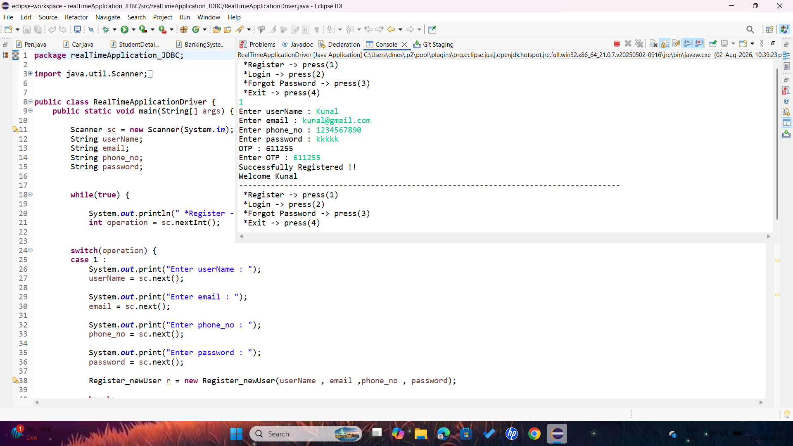
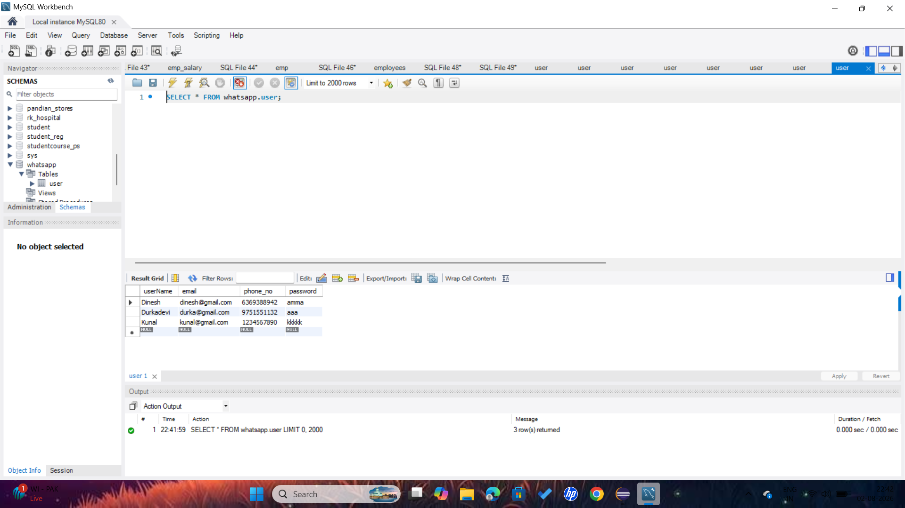
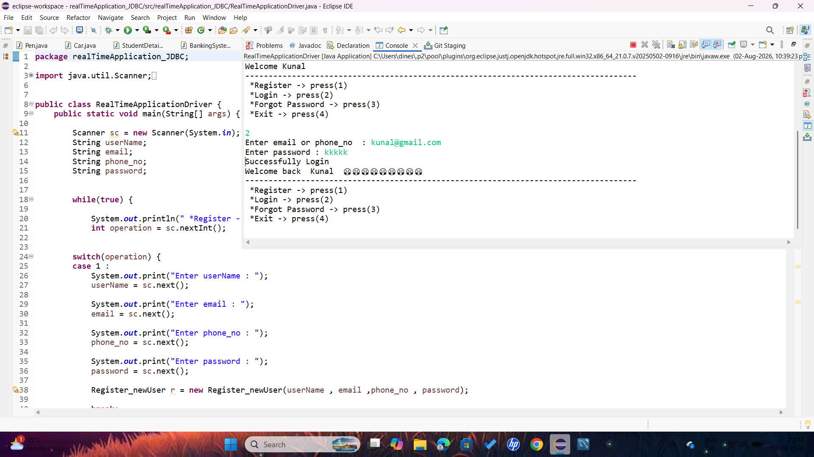
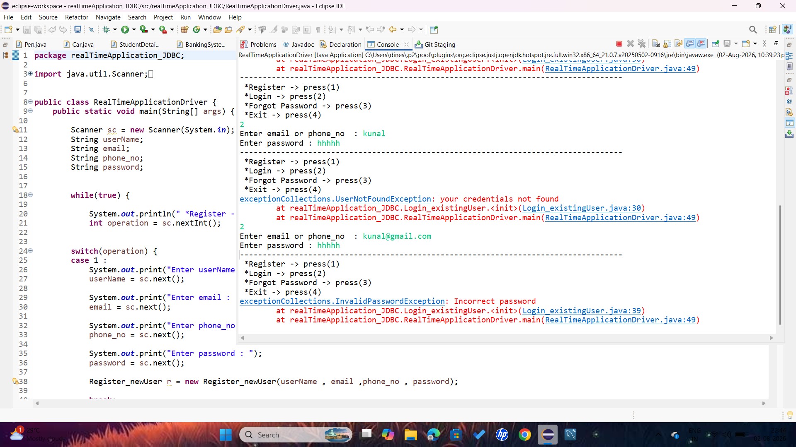
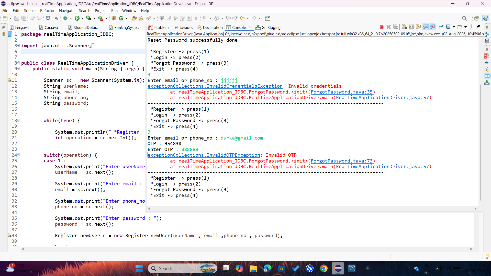

🔐 User Authentication System

 A console-based **User Authentication System** developed using **Java, JDBC, and MySQL**. This project demonstrates secure user authentication with 
user registration, login, forgot password, OTP verification, password reset, and custom exception handling.


 📌 Project Overview

This project is a console-based authentication application that allows users to create an account, 
log in securely using either an email address or phone number, and recover their password through OTP verification.

The project was developed to strengthen practical knowledge of:

- Core Java
- Object-Oriented Programming (OOP)
- JDBC
- MySQL
- SQL
- Exception Handling
- PreparedStatement


 ✨ Features

- 👤 User Registration
- 🔐 Secure User Login
- 📧 Login using Email
- 📱 Login using Phone Number
- 🔑 Forgot Password
- 🔢 OTP Verification
- 🔄 Password Reset
- ✅ Password Confirmation
- 🚫 Duplicate Email Validation
- 🚫 Duplicate Phone Number Validation
- ⚠️ Custom Exception Handling


🛠 Technologies Used

- Java
- JDBC
- MySQL
- SQL
- Eclipse IDE
- Object-Oriented Programming (OOP)
- Exception Handling
- PreparedStatement


 📂 Folder Structure


src
│
├── DBConnection.java
├── RegisterNewUser.java
├── LoginExistingUser.java
├── ForgotPassword.java
├── OTPGenerationAndVerificationProcess.java
├── RealTimeApplicationDriver.java
│
└── exceptionCollections
    ├── DuplicateEmailException.java
    ├── DuplicatePhoneNumberException.java
    ├── PasswordMismatchException.java
    ├── InvalidCredentialsException.java
    ├── InvalidOTPException.java
    └── PasswordResetFailedException.java


 🔄 Project Flow


                          START
                            │
                            ▼
                   Display Main Menu
                            │
      ┌─────────────────────┼─────────────────────┐
      │                     │                     │
      ▼                     ▼                     ▼
 Register User          Login User        Forgot Password
      │                     │                     │
      ▼                     ▼                     ▼
 Enter Details      Email / Phone        Enter Email /
                                          Phone Number
      │                     │                     │
      ▼                     ▼                     ▼
 Validate Data      Validate User         Verify User
      │                     │                     │
      ▼                     ▼                     ▼
 Duplicate Check     Password Check       Generate OTP
      │                     │                     │
  ┌───┴────┐                │                     ▼
  │        │                │               Enter OTP
 Yes       No               │                     │
  │        │                ▼               OTP Valid?
  ▼        ▼          Login Success       ┌────┴─────┐
Throw   Save User                         │          │
Exception                                  No        Yes
                                           │          │
                                           ▼          ▼
                                   Invalid OTP   Enter New Password
                                                       │
                                                       ▼
                                               Confirm Password
                                                       │
                                               Password Match?
                                                 ┌─────┴─────┐
                                                 │           │
                                                No          Yes
                                                 │           │
                                                 ▼           ▼
                                         PasswordMismatch  Update Password
                                             Exception          │
                                                                ▼
                                                     Password Reset Success
                                                                │
                                                                ▼
                                                               END


 🗄 Database Schema

### Database Name
  whatsapp

### Table Name
  user

### Columns

- **id** → INT (Primary Key, Auto Increment)
- **username** → VARCHAR(100)
- **email** → VARCHAR(100) (Unique)
- **phone_no** → BIGINT (Unique)
- **password** → VARCHAR(100)


 ▶️ How to Run the Project

### Step 1

Clone this repository.

### Step 2

Open the project using Eclipse IDE.

### Step 3

Create the MySQL database.

### Step 4

Create the `user` table.

### Step 5

Update database username and password in `DBConnection.java`.

### Step 6

Run:


RealTimeApplicationDriver.java


### Step 7

Select the required option from the main menu.


 📸 Output Screenshots

### User Registration


---

### Database Record


```


### Login Success


```


### Exception Handeling


---

### Forgot password-invalid-credentials


---

### Password Reset Success
    

```


 📚 Concepts Covered

- Core Java
- JDBC
- SQL
- MySQL
- Object-Oriented Programming
- PreparedStatement
- Exception Handling
- Custom Exceptions


🚀 Future Enhancements

- Password Encryption using BCrypt
- Email OTP Integration
- SMS OTP Integration
- Spring Boot
- Hibernate
- REST API
- Frontend (HTML, CSS, JavaScript)
- User Profile Management


 👨‍💻 Author

**Durkadevi**

Java Developer

- Core Java
- JDBC
- SQL
- MySQL
- Object-Oriented Programming

⭐ If you like this project, don't forget to star this repository.
